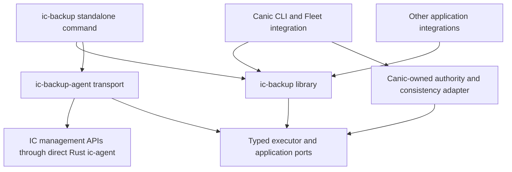

# ic-backup extraction and implementation design

Date: 2026-10-04. Status: proposed product implementation design; the Rust
repository foundation is implemented. This document defines a destination and
delivery sequence. It does not claim an implemented product or accept a Canic
release/minor boundary.

## 1. Outcome

Move generic Internet Computer snapshot backup and recovery out of Canic into
an independent host-side library and operator tool. A non-Canic application must
be able to capture a selected canister, verify the downloaded bytes and recover
it after interruption without installing Canic or understanding Fleet journals.

Canic remains responsible for deciding which physical canisters belong to a
Fleet, proving the selected release and controllers, coordinating application
quiescence and qualifying safe framework restoration. `ic-backup` performs only
the operations authorized by that evidence and its reviewed execution plan.

The intended dependency direction is:



The arrows describe dependency ownership, not Rust trait syntax. The library
defines ports; implementations depend on those ports. The engine must not depend
on the Agent transport package, Canic adapter or downstream application libraries.

## 2. Evidence and starting conditions

Planning input is the Canic working tree on 2026-10-04, whose HEAD was
`d3b1f4ffbbbec8402f3bcef513c7a3db514f93d5`. It was dirty, including concurrent
blob extraction and unrelated repairs. Do not identify this input as an
immutable published release. [Source baseline](source-baseline.json) records
file hashes and inventory counts to detect changed extraction inputs.

Observed starting facts:

- `canic-backup` already owns a separate host-side library with dependencies on
  Candid, Serde/JSON, SHA-256, thiserror and Unix rustix; it has no direct dependency
  on another Canic crate.
- Its source comprises 131 Rust files and approximately 32,416 lines including
  tests at inspection. This is an inventory measurement, not a size-saving claim
  or a required test/source count. The recorded JSON baseline owns exact counts.
- Its public modules include artifacts, discovery, execution, journals,
  manifests, persistence, planning, restore, runners, timestamps and topology.
- Backup and restore runners already inject executor behavior. The backup
  executor exposes status, snapshot inventory, lifecycle, capture and download.
- The library still embeds Canic assumptions: Fleet/environment/Root fields,
  Root-controller and Root-configured read authority, Root-coordinated quiescence,
  role-based backup units and deployment-specific verification.
- Host transport behavior also lives in `canic-host::icp`; local prune and
  important command integration live in `canic-cli`, not only in the crate.
- Fresh `canic backup create` always rejects in the CLI executor's topology
  preflight. The library can use another executor, and existing accepted journals
  retain recovery machinery. Moving the crate does not implement that missing
  adapter or prove current live inventory.
- Current Canic backup selection requires exactly one Fleet Subnet Root. A
  generic explicit member set must not inherit that limitation, nor silently
  claim Canic multi-Root support.

Inspection is a design assessment, not an exhaustive correctness audit. Existing
features and tests are reusable starting material, not a promise that every
current contract is correct or should survive unchanged.

Local primary references, read-only outside this repository:

| Source | Why it matters |
| --- | --- |
| `../canic/crates/canic-backup/README.md` and `Cargo.toml` | Current library boundary and dependencies |
| `../canic/crates/canic-backup/src/` | Generic persistence, artifact and runner mechanisms |
| `../canic/crates/canic-cli/src/backup/` | Selection, executor, local retention and CLI behavior |
| `../canic/crates/canic-cli/src/restore/` | Restore command integration and regressions |
| `../canic/crates/canic-host/src/icp/` | Structured subprocess transport and snapshot commands |
| `../canic/docs/features/backup-and-restore/README.md` | Current availability and same-release policy |
| `../canic/docs/operations/recovery-retry-runbooks.md` | Recovery and operator expectations |
| `../canic/docs/features/runtime/README.md` | Lifecycle composition and timer custody restrictions |
| `../canic/AGENTS.md` | Canic-side ownership and mutation restrictions |

### Upstream references

Verify the selected backend against the current [IC snapshot
guide](https://docs.internetcomputer.org/guides/canister-management/snapshots/),
[management interface specification](https://docs.internetcomputer.org/references/ic-interface-spec/management-canister/)
and the selected [Agent API](https://docs.rs/ic-agent/0.49.2/ic_agent/).
The platform references were inspected on 2026-10-04; the Agent API/source and
locked transport are separately reviewed in the current [qualification](agent-transport.md).

The snapshot guide describes capture of code and application memory, controller
authority for creation/restoration, visibility-controlled reads and local
download/upload. The interface additionally describes optional timer/hook
metadata and warns that metadata upload replacement removes the predecessor
snapshot before all data is uploaded. Stop targets and qualify the actual
backend's capabilities; do not treat API availability or illustrative examples as proof
of complete, durable transfer. These are upstream facts, separate from our
stronger operation-safety requirements below.

Do not hard-code a remembered platform snapshot count, transfer limit or command
flag in the product contract. Select and qualify concrete upstream versions,
encode actual capabilities, and test the maintained adapter against those pins.

## 3. Scope and initial product decisions

The first usable release supports local storage, explicit physical canister
selection and same-release recovery to the same exact existing canister IDs.
It provides a public Rust library and one standalone operator command. The
default non-Canic journey is a single canister controlled by the selected
operator. A multi-canister set can be captured with explicit weaker consistency;
stronger application consistency needs a qualified application adapter.

| In scope | Initial boundary |
| --- | --- |
| Snapshot capture and transfer | Selected existing canisters and pinned backend |
| Bundle verification | Bounded metadata and streamed byte-integrity checks |
| Execution plans and receipts | Exact targets, authority, budgets and effects |
| Crash/interruption recovery | Same operation and retained exact artifacts |
| Restore | Same release, same IDs, no implicit identity mapping |
| Local retention | Verified bundles, lifetime locks and durable references |
| Application integrations | Membership, consistency and external-effect ports |
| Canic extraction/adoption | Separate owner and separately authorized changes |

Initially exclude remote object storage, encryption/key management, scheduled
backup services, a web UI, a canister-based backup service, application database
decoding, schema conversion, estate allocation, canister creation/deletion,
controller changes, cycle transfers, automatic funding and cross-subnet or
cross-release relocation. Snapshots contain sensitive state; private local
permissions and redacted output are required even without encryption support.

Existing source has fixed/relocatable identity modes and mapping support. Their
presence does not expand this design. Import only the maintained same-ID recovery
surface. Broader mapping needs a separate accepted design with application
identity and external-obligation qualification; do not retain dormant aliases
or branches as compatibility promises.

All new product records use the maintained v1 generation. Package semver is
independent of schema generation. Upstream version names and immutable source
evidence keep their truthful versions. Before 1.0, a changed product contract
hard-cuts its maintained v1 representation; it does not add v2 or predecessor
readers. Interrupted work must be completed or safely disposed of under its
own qualified same-release procedure before changing the executable contract.

## 4. Extraction ownership

| Surface | Destination and treatment |
| --- | --- |
| Artifact hashing and safe IO | `ic-backup`; preserve streamed verification and secure path handling |
| Download and execution journals | `ic-backup`; normalize current contracts, keep interruption evidence |
| Durable writes, locks, restore references | `ic-backup`; preserve concrete custody invariants |
| Manifest and topology validation | Generic structure in `ic-backup`; Fleet/Root meaning in Canic adapter |
| Backup/restore plans and runners | `ic-backup`; pure policy plus workflow over injected effects |
| Backup discovery helpers | Explicit-set and graph validation here; live Fleet membership stays Canic-owned |
| Local prune and layout inspection | Move generic behavior from Canic CLI into the library |
| ICP snapshot/status/lifecycle subprocess calls | Retired destination; direct `ic-backup-agent` consumes the existing exact wire codecs without importing Canic Host |
| Generic standalone CLI | `ic-backup-cli`; design around explicit inventory and plan digests |
| Fleet resolution and terminal Ensure state | Remain in Canic Host |
| Coordinator registry and Root authority | Remain in Canic control plane/adapter |
| Native timer custody and lifecycle restore fencing | Remain with runtime/application owners |
| Application consistency and paid-obligation reconciliation | Integration-owned; framework provides typed ports |
| Generic recovery tests | Move with their behavior and requalify here |
| Canic topology/release/endpoint integration tests | Remain in Canic and consume the independent library |

Import provenance and license notices with copied source. Trace every public
consumer before deletion. A package dependency graph without Canic does not
prove a generic schema: remove framework assumptions at the owning contract
boundary, rather than renaming the crate around unchanged Fleet requirements.

The result has one generic implementation. Canic must not retain a second copy
or a Canic-owned crate whose only job is re-exporting the extracted library.
Its operator commands may call the library directly through real integration
code; those commands are adapters with behavior, not compatibility aliases.

## 5. Repository and package layout

The workspace-only root and `crates/ic-backup` library package are established.
Local artifact/persistence machinery, layout lifetime exclusion and conservative
restore-reference retention, command custody, local download/attempt journals and
canonical physical inventories with pure selection, explicit dependency graphs and
immutable declared operation plans with pure retained-journal progress and a closed
IC host-ingress request codec and typed membership/control ports with pure result admission
are implemented; see
[its maintained boundary](extraction-boundary.md) and
[fresh source provenance](extraction-source.json). Capture/restore runners are not implemented. Direct single-update
transport is implemented in `ic-backup-agent`; full workflow/application qualification
remains separate. Create the remaining proposed layout with its
implementation rather than as empty stubs:

```text
crates/
  ic-backup/         # generic host library
  ic-backup-agent/   # direct signed single-update Rust transport
  ic-backup-cli/     # standalone binary named ic-backup
tests/              # cross-package installed-product and PocketIC journeys
fixtures/           # framework-neutral canisters; no consumer database
docs/
  extraction-design.md
  source-baseline.json
  status/current.md
  contracts/        # maintained v1 schemas and canonical hash specifications
  operations/       # capture, restore, resume and retention instructions
```

Start with the library, not three placeholder crates. Use Rust edition 2024,
workspace-inherited dependency declarations and versions, normal directory
modules and separate build artifacts. Do not reuse Canic's `.cargo` settings,
absolute overrides or `target/` directory. Prefer existing published dependencies
over new abstractions and publish packages in dependency order when authorized.

The foundation follows the sibling Rust library conventions: workspace-inherited
metadata/lints, a pinned development toolchain, a local target directory, native
CI, formatter hooks and bounded release helpers. See [development](development.md),
[releasing](releasing.md) and [tooling provenance](tooling-provenance.json).
The host product does not inherit the sibling canister/Wasm validation lanes.

The library should have small owners for model, policy, ops, workflow and DTOs.
CLI endpoints parse/authenticate/select and delegate; workflow coordinates;
policy makes pure decisions; ops performs deterministic access and approved
single-step platform effects. Model owns persisted transitions and invariants.
Do not implement the extraction as one central function with mutable journals.

## 6. Authority, inventory and integration ports

### Exact operation binding

Each reviewed operation binds canonical network identity, selected caller,
source/target principals, release identity, artifact digests, physical membership,
consistency mode, lifecycle policy, effect order, limits and plan digest. Labels,
environment names and paths are presentation/context, not authority substitutes.

Canonical network identity must include enough evidence to distinguish a trusted
IC network from a reset or unrelated local replica at the same URL. Validate
certificate/root-key policy explicitly; never fetch and trust a root key from
an arbitrary endpoint under a mainnet configuration. Lock the resolved backend
and identity selection across the operation; credentials themselves stay out of
records and logs. Canonical principals and digest bytes own equality.

An explicit inventory proves selection only. It does not prove membership of an
application, current controller custody or a globally consistent checkpoint.
The implemented `InventoryRecord` admits a canonical declared forest and hashes
its exact fields. Pure `policy::selection` expands exact principals into read-only
subsets; immutable bounded persistence checks the full original inventory digest.
Missing parent relationships and cycles reject. This declaration/selection boundary
does not itself perform live membership observation. The separate typed
`MembershipProvider` contract and pure matching admission are now implemented;
no qualified provider/backend is installed. See
[the maintained contracts](extraction-boundary.md).
Preflight obtains current status, applicable controller/read permissions and
snapshot capacity evidence through the selected authenticated transport. Public
status/read visibility must never be mistaken for write authority.

### Named ports and implementation boundary

| Port | Owned contract |
| --- | --- |
| `SnapshotExecutor` | Typed status/inventory/capture/transfer/load/lifecycle effects and exact receipts |
| `IcMutationProvider` | Implemented exact original IC update/reserved-mutation envelope and bounded passive acknowledgement association; no installed provider or automatic settlement |
| `IcSnapshotTransferReadProvider` | Implemented exact original metadata/data payload and pending-update request, bounded passive actual-context response and existing decoder association; no installed provider, automatic receipt or read reissue |
| `IcObservationProvider` | Implemented exact original mutation/reserved status-list observation envelope and bounded passive reply association; no installed provider, automatic outcome or lost-observation reissue |
| `IcSnapshotUploadProvider` | Implemented single reserved source-bound metadata/data update signature, reusing exact upload attempts, passive acknowledgements and IC update failures; no installed provider, automatic settlement or retry |
| `IcSnapshotUploadObservationProvider` | Implemented exact original metadata-upload/reserved list observation signature and passive inventory association; no installed provider, allocation outcome, data reconciliation or reissue |
| `IcSnapshotUploadDataObservationProvider` | Implemented exact original destination/extent/reserved readback observation with passive chunk comparison; no installed provider, write attribution, automatic receipt or reissue |
| `MembershipProvider` | Implemented ephemeral original-plan/challenge/boundary request, full current inventory/context result, optional opaque revision/evidence and bounded call reporting; actual provider qualification remains integration-owned |
| `ControlAuthorityProvider` | Implemented exact original IC mutation/challenge request and canonical actual context/target/controllers result; pure direct caller-controller admission only, without live provider or dispatch permit |
| `SnapshotReadProvider` | Implemented original mutation intent plus independent exact list payload/challenge request and actual snapshot visibility/context/target result; pure caller read paths only, without live provider or spending authority |
| `ConsistencyProvider` | Implemented ephemeral current stopped/drained target and existing exact application fence validation under original guarantee; no provider or acquisition/release effects |
| `ConsistencyCoordinator` | Original fence obligation retention and exact acquisition-journal projections are implemented; actual acquisition, authenticated uncertain-effect reconciliation and controlled release remain intended integration responsibilities |
| `FenceReconciliationProvider` | Implemented read-only original pending acquisition/reserved observation binding and pure actual unit/attribution checks; no installed provider, automatic receipts or acquisition/release effects |
| `FenceAcquisitionProvider` | Implemented bounded original application update envelope and exact reserved-mutation/passive acknowledgement association contract; actual permissions, whole-unit semantics and exclusive dispatch custody remain integration-owned, with no installed provider |
| `RestoreSafetyProvider` | Implemented immutable original source/safety requirement and fresh exact load/start evidence matching; actual source, fence, restored acceptance and external-obligation qualification remain integration-owned |
| `ArtifactStore` | Local durable custody, streamed verification, references and retention locks |
| `Clock` | Testable deadline/lease policy; time is not an authority identifier |

Membership, direct-control, snapshot-read, consistency, restore-safety and
fence-reconciliation observation ports have maintained Rust signatures. The acquisition
update port and exact IC mutation/recovery-observation/upload ports also have maintained
Rust signatures; other rows remain intended
responsibilities. The membership request derives exact original intent
and operation identity, immutable full inventory/selection, a caller-owned fresh
challenge, explicit before/after boundary and 0–1,024 descriptive remote-call
ceiling. Actual result context and full inventory must match; policy rejects old
challenge/boundary results and excess reported calls without IO or state changes.
No request/result/view has Serde or persisted authority admission. Provider
freshness, prior approved per-call accounting, lost replies and revision/evidence
meaning remain integration-owned. A ceiling is not a reservation or fresh budget.
Matching hashes or revisions before and after do not exclude changes between
observations.
See [the typed membership contract](contracts/membership-port.json).
The [typed control contract](contracts/control-authority-port.json) separately
validates original mutation bytes and requires the actual selected caller in a
complete known canonical controller set. Another controller, Root/parent proxy,
read visibility or subnet-admin exception cannot satisfy this direct-host lane.
Control results are ephemeral too; no Proven flag upgrades a plan. Actual provider
authentication/freshness, load source/origin permissions and full effect admission
remain separate qualification work.
The [typed snapshot-read contract](contracts/snapshot-read-port.json) binds exact
independent list bytes to original mutation intent. Its actual snapshot visibility
is distinct from status/log visibility. Known exact controllers, public visibility
or exact allowed viewers can establish a read-only matching view. Unknown controller
evidence cannot establish a controller path; independent public/viewer access needs
no controller projection. No Root-configured/Proven declaration, read success or
matching digest supplies mutation control, fresh spending or settlement of a lost
observation. The separate metadata/data codecs grant no current read permission;
complete transfer and actual provider qualification remain pending.
Prefer separate ports over a single all-powerful executor. Requests and results
use named passive structs/enums. Integration implementations convert their framework evidence into
generic inputs; they do not give the engine raw application journals or code.

A `ReleaseBinding` is exact opaque evidence supplied by the application owner.
The generic engine checks equality and binding, not Canic release semantics.
The single-canister standalone profile binds exact selected Wasm bytes/digest;
an application profile may bind a larger release manifest. Existing corrupted
runtime state need not be decoded to obtain current controller evidence.

Serialized `Proven` flags and receipts are auditable records, not signatures or
self-authenticating authority. Trusted execution creates them from observations;
effect-boundary checks establish their continuing applicability. Do not let an
operator-edited JSON field bypass preflight. Missing required providers fail
with a typed unavailable result before remote mutation.

## 7. Consistency and application safety

Maintain two explicit consistency guarantees:

1. `per_canister`: each stopped target's snapshot is internally qualified;
   the bundle makes no atomic multi-canister claim.
2. `application_coordinated`: a qualified application adapter fences writes,
   membership changes, relevant timers and external work for the entire selected
   unit, proves drained work and retains that fence across interruption.

`ConsistencyRequirementRecord` now retains this requested choice under exact full
original plan intent; immutable local publication/read has a strict v1 schema and
1 KiB input/output bound. Declaration equality establishes no actual guarantee.
No missing or edited declaration silently downgrades coordinated capture. See
[the requirement schema](contracts/consistency-requirement.schema.json).
The [typed current consistency port](contracts/consistency-port.json) binds the
original requirement/operation, challenge, before/after capture boundary and exact
integration-retained fence identity plus original membership revision. Actual
context/full inventory/exact selected target rows must match, with every target
stopped and drained evidence qualified by its owner. Coordinated results require
an actually Active exact fence, with actual/fence revisions both equal to the
original retained revision, plus whole-unit write/membership/timer/external-work
fencing and drained-work evidence. No accepted/expiry/Proven flag upgrades a plan.
This port validates existing obligations; acquisition/release, actual continuous
fence custody, per-call accounting and backend/lifecycle qualification remain with
their owners. Models/policy cannot authenticate opaque evidence hashes or prove
continuity by matching before/after values. Capture wire/effect admission and
restore/external-obligation safety remain separate contracts.

Stopping canisters sequentially is not an application-consistent distributed
checkpoint. A matching topology hash before and after capture also cannot
exclude intermediate membership changes; use an authority revision and a real
fence when claiming a stable unit. Static topology without an app fence supports
only the weaker guarantee.

Record each target's initial running/stopped state and the reviewed final state.
Do not start a canister that was already stopped unless explicitly selected.
Do not automatically release a consistency fence on timeout, process death,
partial capture or restore failure. A failed operation retains the exact safety
obligation and exposes a reviewed continuation/disposition action.

`FenceObligationRecord` now retains the exact original plan/selection, capture or
restore requirement, chosen fence/revisions and explicit application acquisition
operation before reservation/dispatch. Its immutable 1 KiB publication requires
retained originals; restore checks both guarded plans. Recovery joins the exact
original attempt journal, without inventing another accounting ledger or treating
missing evidence as unspent. Pending and settled outcomes retain the declaration.
An Applied projection does not establish current Active custody or authorize
release. No coordinator implementation, acquisition/release action, release flag
or terminal admission exists. Original request semantics and whole-selection
fence custody remain integration-qualified. See
[the schema](contracts/fence-obligation.schema.json) and
[implemented boundary](extraction-boundary.md#original-application-fence-obligation-retention).

Fence reconciliation now binds an already pending original acquisition and its exact
reserved observation. Actual context, full inventory, selection and both attempt IDs
must match. Acquisition needs exclusive original-request attribution and the exact
Active fence/revisions; restore also retains whole-unit, rewind-independent custody
and replay-safety evidence. Current absence/inactivity cannot prove nonapplication.
Lost provider replies remain pending and spent; settled uncertainty and retained
late replies are distinct. Pure views create no receipts, redispatch or release.
Actual authenticated providers, acquisition and controlled release remain pending.
See the [typed contract](contracts/fence-reconciliation-port.json).

Application acquisition now has a bounded exact host update envelope. Its canonical
receiver, mode, exact method and opaque arguments are hashed before the plan, avoiding
a cycle through requirement/obligation digests. The original acquisition operation
subsequently binds that digest. Requests require an already reserved exact mutation
and no pending observation recovery. Provider admission still needs actual context,
permissions, original whole-unit argument semantics, complete prerequisites and
exclusive proof of no prior dispatch. The single-update contract forbids hidden
reissues/observations; reconstructed pending requests supply no retry authority.
Acknowledgements associate full original authority and exact mutation only, with
no outcome, current Active proof or automatic receipt. Failures keep pending consumed
spending and original obligations/source references. Actual application codecs,
authenticated providers and controlled release remain unimplemented. See the
[typed contract](contracts/fence-acquisition-port.json).

Snapshot load can restore old journals, timer state and application intent while
external payments, providers and other canisters have already advanced. An
application with irreversible effects must prove settlement or maintain a
restore fence outside the rewindable snapshot. A generic default cannot certify
that property. Canic's custody restrictions and blob/auth service contracts
remain their owners' qualification work; extraction must not bypass them.

The implemented restore-safety declaration retains exact original restore/source
intent and source artifact binding, same-network/release existing IDs, explicit
no-irreversible-effects or application-fenced lane and original outside-snapshot
fence revisions. Fresh requests bind original exact load/start bytes and challenge.
Pure admission requires actual full inventory/selection/source/lane, all stopped
targets before load and source-specific restored acceptance before start. A
fenced start additionally needs qualified controlled execution. No provider,
fence acquisition/release, complete source manifest/transfer qualification or
uncertain-load settlement is installed. See
[the requirement schema](contracts/restore-safety-requirement.schema.json) and
[typed port contract](contracts/restore-safety-port.json).

The standalone single-canister example must state its assumption: the selected
application has no unreconciled irreversible external effects. Applications that
cannot establish this condition need `RestoreSafetyProvider`, and execution
rejects without suitable evidence. A generic `--force` bypass is not a solution.

## 8. Maintained records and hashing

Freeze machine-readable v1 JSON schemas and canonical hashing rules before
moving execution code. Human selection/configuration uses TOML. Reject unknown
schema fields and missing required nullable fields where required by the current
contract. Bound counts, strings, depth and total metadata bytes before allocation.

The implemented learned-stage binding uses a distinct `ExecutionWorkflowRecord`
for original stage allocations and `ExecutionStageBindingRecord` for later exact
child plans. The allocation reuses ordinary plan structural validation; its request
hashes commit integration-owned stage input/purpose contracts and are never wire
requests or journal authority. Each fixed stage directory retains one ordinary
exact child plan within the original target/context/inventory and stage ceilings.
Predecessor bindings and complete chronological Applied settlements are required
before creating the child. Learned snapshot ID/dimension evidence is an opaque
commitment whose authenticity and derivation remain integration-qualified.
Local stage admission checks complete exact chronological settlements and original
journals throughout the ancestor DAG, visiting shared ancestors once with sequential
locks. Missing or changed transitive evidence rejects; no atomic byte-custody claim
follows. Reopen preserves original journals; interrupted preparation stops with evidence
retained. No workflow runner, automatic outcome, fresh permission, transfer
completion or terminal/release authority follows. See
[the implemented contract](extraction-boundary.md#original-workflow-allocations-and-learned-stage-binding).

The implemented metadata-derived data planner counts complete region/chunk reads
before allocation and binds exact requests to an original finite data stage. Every
request retains one update and zero observation allowance under explicit sequential
dependencies. Testkit qualifies an isolated complete capture/download/publication
journey and safe stopping after lost/malformed data replies. This does not install
the proposed generic runner or qualify a real application's fresh admission.
See [the planner contract](extraction-boundary.md#metadata-derived-original-download-planning).

| Record | Required purpose and binding |
| --- | --- |
| `BackupPlanRecord` | Exact membership, network/caller/release, consistency, effects and budget authority |
| `PreflightRecord` | Observations and fence evidence bound to the complete plan and execution attempt |
| `BackupJournalRecord` | Attempt consumption, dispatched intent, observations, receipts and progress |
| `DownloadJournalRecord` | Exact snapshot/artifact identity, transfer extents and durable byte verification |
| `BackupManifestRecord` | Complete verified artifacts, snapshot provenance, source identities and consistency guarantee |
| `RestorePlanRecord` | Exact manifest, same-ID targets, preconditions, safety fence, effect graph and budgets |
| `RestoreJournalRecord` | Upload/load/lifecycle/verification progress and uncertain-effect reconciliation |
| `RestoreReferenceRecord` | Durable dependency on source artifacts, including external journal location |
| `CompletionReceiptRecord` | Exact local terminal evidence and effect/accounting summary for replay |

The local `DownloadJournalRecord` lifecycle now retains exact principal/snapshot
identity and observed timestamp/size, fixed relative locations, checksum evidence
and the four local states. Its schema and guarded persistence are documented in
[the maintained boundary](extraction-boundary.md). This implements local artifact
progress only. `AttemptJournalRecord` additionally binds exact declared operation
identity and immutable mutation/observation limits, consumes reservations durably
and replays chronological receipts. Its schema specifies canonical authority
hashing. This local accounting grants no fresh authority or dispatch permit;
backend metadata/extent qualification, bounded backend calls, remote-effect
reconciliation and full completion/manifest binding remain required before runners.
`InventoryRecord` now has a closed v1 schema with required nullable fields,
canonical order, bounded graph admission and an unambiguous binary hash. Its
selection projections preserve original parent links and full inventory binding.
`EffectGraphRecord` now retains bounded exact opaque operation sequences and
explicit closed acyclic dependencies. Canonical hashing and deterministic planning
order are model-owned; pure readiness validates declared causal progress. This
graph is one component of a future complete plan, not a plan, receipt or execution
permit. Integration-qualified application dependencies must be declared explicitly.
`OperationPlanRecord` now binds full inventory/selection, graph and one exact
target/request/original-budget declaration per graph node to shared network/caller/
release context. Its canonical digest owns intent for derived attempt authority;
checked assigned totals fit immutable aggregate ceilings. It is not a complete
authenticated backup/restore plan: typed payloads, application safety, lifecycle,
preflight and actual execution remain outside this local binding primitive.
Pure execution progress now admits the complete original attempt-journal set,
checks exact plan/context/target/request/limit binding and projects retained
Applied/pending/exhausted conditions in explicit graph order. Attempted operations
with unmet Applied prerequisites reject. This local projection does not prove
cross-journal dispatch chronology, authenticate receipts or establish terminal
completion; missing journals are never reconstructed as empty evidence.
`ExecutionSettlementRecord` now retains the complete exact original journal
fingerprints under the full plan digest. Pure admission reuses progress, requires
every operation Applied and matches full chronological authority/reservation/receipt
hashes; equal final projections cannot hide changed evidence. Its immutable v1
checkpoint has 8,192-row/2 MiB bounds. Guarded publication/reopen read the retained
original plan and journal set locally, using bulk canonical authority derivation
and sequential journal locks. It adds no accounting owner or terminal flag and
qualifies no actual receipt, full backup/restore completion, command quiescence or
release admission. See the [schema](contracts/execution-settlement.schema.json).
The IC-specific request boundary now encodes exact status/inventory, stop/start,
capture and load Candid arguments under pinned upstream types. Its v1 wire digest
binds fixed receiver, effective target, replicated update mode, method and argument
bytes; original mutation and separate observation digests admit exact payloads.
Raw snapshot bytes and generic backend tokens remain distinct owner boundaries.
Bounded capture/inventory reply decoding additionally retains exact raw snapshot
IDs and required nat64 timestamp/size fields. Inventory views are canonical and
reject duplicate IDs; local evidence hashes bind the declared request and exact
raw response. The wire contains no target/network/caller identity, so association
is integration-qualified rather than authenticated by decoding. No decoded reply
settles a pending journal or attests transfer completeness. See
[the reply contract](contracts/ic-snapshot-reply.json).
Pure inventory comparison now rejects lost or changed baseline descriptors and
projects new exact-ID candidates under the capture/list declarations. It preserves
original reply evidence but establishes no capture attribution or observation
chronology; even a singleton cannot settle a lost paid call. See
[the comparison contract](contracts/snapshot-inventory-delta.json).
The existing status/stop/start/load methods now have a bounded local lifecycle
reply owner. It retains required status/controller projections or canonical empty
acknowledgements, with raw-request/reply evidence binding. Unprojected status
metadata stays unqualified. Neither a Stopped value nor a decoded acknowledgement
proves actual freshness, continuous fencing or safe load settlement. See
[the lifecycle reply contract](contracts/ic-lifecycle-reply.json).
Remaining response/transfer semantics, transport and fresh effect-boundary
authority still require qualification.

Persist immutable reviewed intent separately from mutable execution observations.
Refreshing authority, progress or timestamps cannot change issued spending limits,
selected bytes or destructive dispositions. A changed plan needs a distinct
reviewed operation; unsettled prior effects remain an explicit prerequisite.

Canonical hashes bind exact machine-relevant fields using a specified unambiguous
encoding with domain separation. Specify integer widths, null representation,
principal encoding, sorted-set versus ordered-list semantics and hash exclusions.
Do not hash pretty-printed JSON or explanatory messages. Structural identifiers
must reject duplicates and cycles rather than rely on overwrite order.

Topology and artifact identities are separate. Artifact tree digests bind a
deterministically sorted set of relative paths, file lengths and file SHA-256
digests; exclude host permissions and mtimes from content identity. Reject path
encoding aliases and collisions. Normalize valid uppercase/lowercase hash input
to digest bytes, then emit one canonical lowercase representation.

Snapshot data is opaque to application schemas, but not opaque to transfer
integrity. Validate the pinned upstream metadata shape, declared lengths, expected
files, globals, certified data, chunk-store identities and applicable timer/hook
fields. Preserve exact backend artifacts across retries. A verified code hash
alone does not verify heap, stable memory, globals or snapshot-load success.

The local `model::ic_snapshot_metadata` codec now encodes exact metadata-read
arguments and admits bounded pinned SDK metadata without installing a provider.
It preserves required nat64 fields, ordered global values (including unavailable
slots and floating bits), chunk identities and optional source/timer/hook values.
Absence is retained and cannot supply an upload default. Exact raw evidence remains
distinct from canonical values. Complete data extent coverage, authentic association,
fresh read permissions, original per-call accounting and complete transfer/upload
qualification remain integration work. See
[the implemented boundary](extraction-boundary.md#bounded-ic-snapshot-metadata).

`model::ic_snapshot_data` now borrows that exact metadata to encode checked nonzero
Wasm/heap/stable ranges or known chunk-store identities. Bounded replies require
the requested byte length or exact matching chunk SHA-256, including empty known
chunks. Evidence retains metadata/request/raw-byte association without a provider,
extent ledger, scheduling, new accounting or a full-transfer claim. Integrations
still qualify durable every-region/chunk byte custody, authenticated snapshot identity,
fresh read access, prior per-call authority and upload/load/terminal safety. See
[the data boundary](extraction-boundary.md#bounded-metadata-bound-ic-snapshot-data).

`model::ic_snapshot_coverage` now owns incremental declared coverage of admitted
replies: three contiguous zero-based region cursors and one presence bit for each
retained chunk. Regions can interleave and chunks can arrive in any order; gaps,
overlaps, duplicates and changed metadata evidence reject without advancement.
Every exact size and chunk must be covered before a read-only view appears.
Admission retains no data, has no aggregate size sum or new call allowance, and
starts empty when reconstructed. Complete declared coverage therefore supplies
no byte custody, durable artifact, authentic association or backend completeness.
Integration qualification of durable exact full-state transfer remains separate.

Ordinary metadata/data reads now have an original-plan-bound
`IcSnapshotTransferReadRequest` and single-call provider contract. Exact wire/target
identity and pending update reservations remain with the original plan/journal;
pure passive response association rechecks actual claimed context and delegates to
the existing bounded decoders. Replicated reads use the existing mutation lane.
Lost replies retain spending and cannot be reissued from pending state. No installed
provider or automatic receipt/aggregate transfer proof is introduced. The real
PocketIC driver uses this public boundary before explicit success recording; see
[the contract](contracts/ic-snapshot-transfer-read-port.json).

The opt-in local `IcSnapshotArtifactWriter` now binds that admitted coverage to
private exact region/chunk bytes, original raw metadata/request and incremental
checksums. Before another append, every region name must still select its held
regular file at the original coverage length. Detectable drift rejects before
coverage admission or further writes; sequential checks establish no byte fence.
Complete fresh tree checks persist the expected checksum in the existing
download journal before its canonical durable publisher runs. Publication recovery
uses the retained journal; partial Created transfers are preserved without automatic
coverage reconstruction or repeated reads. Generic token/raw-ID mapping, authentic
complete backend transfer, fresh permissions/accounting and stable noncooperating
custody still require integration qualification. See
[the implemented local artifact boundary](extraction-boundary.md#durable-metadata-bound-ic-snapshot-artifacts).

Explicit `verify_ic_snapshot_artifact` checks one published tree under the full
retained original plan and unchanged journal. It reuses complete Durable selected-set
admission, then verifies exact format/metadata/request, region lengths, bounded chunk
hashes and the existing retained checksum. Only that target's bytes are checked;
ordinary resume stays artifact-free. Passive sequential checks retain no fresh byte
custody and authorize no upload.

`model::ic_snapshot_upload` now binds representable original metadata and bounded
source slices/chunks to the same target and a distinct new destination ID. Explicit
guarded preparation verifies retained source bytes; each upload payload's source/wire
binding precedes its own immutable plan and original mutation reservation. Passive
reply admission retains pending spending and proves no destination attribution or
complete upload. Live transfer permissions, providers, original dispatch custody and
lost-effect reconciliation remain integration work. See
[the upload boundary](extraction-boundary.md#original-source-bound-ic-snapshot-upload).

Explicit local IC-tree verification and upload preparation now expose per-guard
`ic-metrics` summaries and a bounded prepared-size histogram. Host durations use nanoseconds, successful prepared data uses
bytes, and returned successes/rejections stay separate. Internal verification and
enclosing preparation overlap; repeated preparation is another sample rather than
unique transfer progress. These in-memory diagnostics start empty on reopen and
never enter records, hashes, policy admission, spending or terminal evidence.
See [the diagnostic boundary](extraction-boundary.md#local-ic-snapshot-diagnostics).

Original-plan-bound local execution admission now joins persisted plans and every
retained attempt journal through a sequential-lock reader shared with settlement.
The opt-in planned mutation/observation reservations preserve the existing spending
owner and reject missing evidence; mutations require retained Applied prerequisites.
Local progress/reopen changes no accounting or references. Fresh permissions,
backend dispatch custody, receipt authenticity and application safety remain
integration-owned. This boundary reduces runner-side reconstruction without
installing a scheduler or choosing another transport.
See [the implemented admission](extraction-boundary.md#original-plan-bound-retained-execution-admission).

## 9. Backup workflow

1. Resolve the explicit network, caller, inventory and release inputs. Compile
   a bounded plan and effect dependency graph. Planning may observe current
   state, but performs no remote mutation.
2. Retain the immutable plan and display its digest, targets, consistency claim,
   expected lifecycle states, limits and remote snapshot retention consequence.
3. Execution requires the exact reviewed digest. Acquire operation, target and
   local layout locks in a documented order before accepting preflight.
4. Obtain fresh authority, capacity and consistency evidence. Publish the
   execution journal before any stop, fence mutation or snapshot effect. Fence
   acquisition is itself an effect with intent and recovery, not an invisible
   preliminary action.
5. Stop selected targets according to the qualified dependency graph and wait
   with bounded observations for `Stopped`. Preserve initial lifecycle states.
6. Revalidate the exact membership/fence and target authority immediately before
   capture. Record intent and consumed attempt allowance, then capture. Bind
   each exact returned snapshot ID to its target and operation.
7. Release/restart only when the qualified consistency policy permits it. Never
   allow partial-unit restart to invalidate the claimed capture guarantee.
8. Download each retained snapshot to private temporary storage. Resume exact
   immutable snapshot bytes; validate length/content and publish artifacts durably.
9. Verify the complete bundle against the retained plan and receipts, then publish
   the manifest without overwriting conflicting evidence. Retain its original
   timestamp/tool identity when recovering publication after a lost final receipt.
10. Publish terminal completion and release only obligations proven complete.
    Replaying the same terminal operation returns that receipt locally.

Remote snapshots remain accounted for; local manifest publication does not delete
them. Initial implementation does not silently replace or delete a prior snapshot
to make room. Capacity exhaustion yields a typed planning/preflight failure and
an explicit separate disposition, preserving recoverable data.

## 10. Restore workflow

Restore overwrites application state. Planning and dry-run never upload, load,
stop, start, mutate an application fence or claim new live authority was granted.

1. Resolve and lock the selected backup once. Parse bounded records and verify
   complete artifacts. Select exact same-ID targets and the same release binding.
2. Obtain application-owned restore safety and dependency information. Reject
   mismatched network, release, identities, unsafe obligations or unsupported
   guarantees before effects. An archived bundle is not authority to control a
   canister now.
3. Produce an immutable restore plan and explicit reviewed digest. Include target
   status/controllers, exact source digest, upload/load identities, final lifecycle
   state, dependencies, bounds and required post-load verification.
4. Durably retain a source-layout reference before publishing a recoverable restore
   journal. An external journal path uses the same dependency contract.
5. Acquire/revalidate restore safety fencing and current write authority. Stop
   the selected set and verify stopped preconditions with bounded observations.
6. Upload exact retained snapshot metadata/data. Persist each target-local uploaded
   snapshot ID and enough progress to reconcile interruption. Full upload is
   required before load; metadata creation alone does not prove that condition.
7. Revalidate target identity, authority, stopped state and fence, then load the
   exact qualified snapshot. Persist intent before the request and reconcile a
   lost reply without blindly repeating load.
8. Verify the required restored state and application acceptance while targets
   remain fenced/stopped where possible. Follow the adapter's declared dependency
   order; parent-before-child is a Canic integration rule, not a universal
   assumption for arbitrary IC applications.
9. Start only targets whose selected final state is running and whose application
   safety conditions are satisfied. A verification step requiring execution must
   define what work is allowed under the retained fence before public release.
10. Publish terminal evidence after all effects, verification and subprocess
    lifetimes are settled. Release the durable artifact reference afterward.
    Recovering reference release performs local work only.

If complete restoration cannot be proven, leave the affected unit stopped/fenced
with typed operator-attention state. Do not compensate by loading an older bundle,
creating replacement canisters or changing controllers. Those are new operations
outside the initial product scope.

## 11. Interruption and uncertain effects

An effect has states such as planned, intent-persisted, dispatched, outcome-unknown,
observed-complete, safely-retryable, attention-required and terminal. Specify the
legal transitions in code; error text cannot drive recovery. A dispatch consumes
attempt authority even when its reply is lost. Counters never reset on restart.

| Interrupted boundary | Required recovery |
| --- | --- |
| Journal persistence before dispatch | Prove whether dispatch began; otherwise reconcile conservatively |
| Stop/start reply lost | Observe exact target lifecycle and remaining obligation; bounded state-equivalent retry only if qualified |
| Snapshot creation reply lost | Reconcile exact before/after inventory and operation evidence; ambiguity stops creation retry |
| Metadata upload reply lost | Recover the target-local snapshot identity from authoritative evidence; do not create another by assumption |
| Data transfer interrupted | Resume only confirmed exact offsets/bytes on the same snapshot; count any paid reissue |
| Artifact rename before receipt | Verify/adopt exact published bytes and complete directory durability |
| Manifest publication before terminal receipt | Adopt exact manifest; preserve issued metadata; reject conflict |
| Snapshot load reply lost | Use authoritative load/history evidence or a qualified postcondition; identical module hash is insufficient |
| Child process outlives parent | Its custody lock remains held; another runner/prune cannot assume quiescence |
| Terminal receipt before reference release | Verify local terminal evidence and finish local reference release |

Snapshot APIs do not supply a generic application operation ID. Inventory
timestamps and a new snapshot count are not by themselves a unique receipt if
another controller can act. Freeze a concrete reconciliation method in B1 and
prove it with the selected backend. Where sufficient evidence is unavailable,
return `UncertainEffect` with retained evidence rather than inventing exactly-once
behavior. Local process locks do not exclude independent remote controllers.

Distinguish automatic same-operation continuation from an explicit successor
review. A new budget cannot authorize duplicate unresolved spending. Exhausted
operations may still use their separately bounded observation allowance to
recognize success without another mutating call.

Terminal replay validates exact retained plan/journal/completion bindings and
does not invoke remote status, inventory, discovery, identity-tool probes or
paid commands. A new live verification operation reports current state separately.
After source references are released, pruning may remove artifact bytes; terminal
replay uses retained completion evidence rather than silently reacquiring them.

Original all-Applied execution settlement replay is now implemented as a local
checkpoint primitive. It verifies retained original plan/journal fingerprints,
without calling providers or fresh artifact/application checks. Full product terminal
evidence still requires qualified effects, manifests/transfer, application safety
and command custody before reference or fence release; these are not inferred from
the local ledger checkpoint.

Immutable local download manifest publication now reuses the existing v1 download
journal record after guarded original-plan-bound fresh verification. Its canonical
digest seals exact snapshot tokens/metadata, derived paths, Durable states and
checksums. Local replay checks original retained plan/journal identity and reads no
artifact trees. This is a retained local artifact-set declaration, not the proposed
complete `BackupManifestRecord`: authenticated capture/transfer, consistency/effect
evidence and product terminal admission remain necessary. It releases no references.

Explicit fresh local restore-source verification now joins both retained original
plans, immutable safety requirement and exact local download-manifest digest with
the unchanged guarded source journal. Canonical owners require same network/release,
existing selected IDs and complete Durable source coverage. A read-only selection
borrows original artifacts without rebinding; a subset still needs application
qualification. Every original source tree is verified, including those outside that
subset, with original records re-admitted before/after traversal under both layout
lifetimes. Generic integration source digests are not reinterpreted. Local replay
performs no fresh verification; no transfer, upload/load/start, current authority,
application safety, terminal or reference/fence release proof follows from this join.

Private operation-bound local restore artifact staging is also implemented. Complete
fresh original-source admission precedes a no-follow descriptor copy into a new private
direct child of the held restore layout. Copied and freshly checked destination hashes
must match the exact original artifact checksum. Retained declarations are re-admitted
before returning; original accounting/fences/references remain unchanged. Occupied
destinations reject and failures/drop retain unfinished bytes. Explicit retained-copy
verification needs exact original metadata and copy bytes, without reading source trees
or recreating a copy. Staging is not durable publication; future byte custody, backend
upload/extent completeness and current dispatch/application safety remain separate.
See [the maintained boundary](extraction-boundary.md#private-original-operation-restore-artifacts).

Separate durable restore-copy publication now reuses exact retained original-source
admission, the selected checksum and canonical descriptor synchronization/atomic
no-replace publication. Recovery verifies/synchronizes the matching canonical tree
without rereading source trees or repeating a copy. Original records are re-admitted
before/after; all accounting, obligations and references remain unchanged. Published-
copy verification is a distinct fresh local check, not durability inferred from a
path. Failures retain conflicting/partial/published evidence without repair or cleanup.
Backend completeness, application safety and effect/release authority remain separate.
See [the maintained boundary](extraction-boundary.md#durable-original-operation-restore-artifacts).

Exact originally reserved IC capture/load/start/stop requests now join the full
original plan, immutable attempt authority and existing canonical IC payloads.
A single-update port and bounded passive reply association reuse existing capture
and lifecycle codecs; no provider implementation or dispatch/effect settlement is
imported. Missing/different reservation or pending recovery observation rejects.
Retained context/target claims and wire bytes authenticate no provider and grant
no fresh permissions, replay/retry, restoration safety or terminal/release proof.
Actual dispatch custody, source/upload/application qualification and lost-effect
reconciliation remain necessary before runners. See
[the maintained boundary](extraction-boundary.md#exact-originally-reserved-ic-mutation-updates).

Exact status/list recovery observations now bind both pending original attempt IDs,
the original mutation and already reserved canonical observation bytes. Passive
association rechecks the current journal and actual claims, then uses existing
bounded status/inventory codecs. A failed observation stays pending; decoded
Stopped/controllers or inventory cardinality produce no automatic outcome.
Fresh method-specific read permissions, authenticated timing/attribution and
exclusive original dispatch custody remain integration-qualified. See
[the maintained boundary](extraction-boundary.md#exact-originally-reserved-ic-recovery-observations).

Metadata-upload recovery now has an exact original-plan/source-bound list observation
request and single previously reserved observation port. It reuses existing passive
responses, current reservation checks and bounded inventory decoding. Zero/one/many
snapshots establish no allocation outcome; lost observation replies remain pending.
Original baseline custody, exclusive authenticated allocation attribution and data-
upload reconciliation remain integration work. See
[the maintained boundary](extraction-boundary.md#exact-originally-reserved-metadata-upload-observations).

Data-upload recovery now has an exact original-plan/source-bound destination readback
request and single already reserved observation port. Known uploaded destination
metadata, original dimensions and exact raw ID/extent/hash are required. Current
reservations and passive claims reuse canonical admission; existing bounded data
decoding returns bytes and original-chunk comparison. Matching/different bytes
produce no write outcome or receipt. Actual allocation/write attribution, read
permissions, chronology and backend capability remain integration-qualified. See
[the maintained boundary](extraction-boundary.md#exact-originally-reserved-data-upload-observations).

Successful exact data-read evidence now supports a separate passive original-write
settlement admission. It binds full original authority/both pending attempts, a
fresh qualification challenge and exact existing metadata/read/raw-reply/observation
identity. Matching bytes additionally require exclusive original-write attribution;
negative claims require exclusion of transient application/overwrite. Actual settled
uncertainty is distinct from a lost read. Pure views perform no IO or journal change;
only qualified integrations use the existing receipt transition, retaining all
consumption and original obligations/references. Authentic attribution and backend
qualification remain integration work. See
[the maintained boundary](extraction-boundary.md#exact-data-upload-settlement-claims).

Metadata-allocation settlement now binds exact original/current inventories,
reservations and challenge to independent passive attribution. It reuses closed
baseline comparison; Applied names a new non-source ID rather than selecting a
singleton. Negative evidence excludes transient allocation/deletion, while settled
uncertainty remains distinct from lost replies. Existing receipt owners retain all
consumption and source obligations. Actual authenticated attribution/backend
qualification remain integration work. See
[the maintained boundary](extraction-boundary.md#exact-metadata-upload-settlement-claims).

Original capture settlement now binds independent claims to exact full baseline
and already spent list evidence. Applied names an explicitly attributed new raw ID;
candidate cardinality never implies a receipt. The existing closed-baseline and
journal owners retain all metadata, consumed allowances and original obligations.
Actual original baseline chronology, authenticated attribution/custody, capture
consistency and backend qualification remain integration-owned. See
[the maintained boundary](extraction-boundary.md#exact-independently-qualified-capture-settlement).

## 12. Filesystem custody, durability and retention

Layout lifetime exclusion and durable reference retention are implemented with
the bounded v1 contract in [the maintained boundary](extraction-boundary.md).
Owned command descriptor custody and exact existing-sidecar quiescence are also
implemented with native process evidence. Backend-specific custody qualification
and terminal reference release remain unimplemented.

Preserve the existing three concrete protections: layout lifetime exclusion,
operation journal serialization and subprocess lifetime custody. A path-local
lock inside a directory being deleted is insufficient. Layout lifetime locks
live beside that directory and retain stable identity throughout removal.

Resolve an operator-selected root once; relative paths and an explicitly selected
root link may be supported. Links, traversal, device files, sockets and unsafe
reparse/special-file behavior inside the artifact tree reject. Avoid time-of-check
versus time-of-use races with descriptor-relative, no-follow operations and
validate file identity while streaming. Sanitized display names cannot define
artifact identities or overwrite two colliding canister names.

Private temporary files, complete write, file synchronization, atomic publication
and parent-directory synchronization are required where the supported OS offers
the qualified primitives. A failed sync is not completion. Declare local filesystem
assumptions; no unqualified NFS/object-store durability promises. Begin with
Unix platforms matching the source's mechanisms; advertise Windows only after
equivalent lock, custody and crash tests pass.

Publish a restore reference while holding the layout guard and before its journal
becomes recoverable. Paused, failed, interrupted or externally located journals
retain that reference. Missing/moved journals do not release it. Terminal release
requires exact journal binding and proof that inherited subprocess custody has
ended. A durable reference without its journal is conservative retention, not
permission to delete it; expose an explicit recovery/disposition report.

Local prune verifies complete bundles and exact checksums before counting retained
copies, holds the necessary guards while selecting/deleting, and skips busy,
invalid or restore-referenced layouts with typed reasons. `keep = 0` selects no
ordinary retained copies, but does not bypass recovery references. Partial
deletion reports completed removals plus failures and returns a failure result.
Local prune never deletes live IC snapshots.

The illustrative layout is a plan, execution/download journals, a complete
manifest and snapshot directories under one private bundle root; restore journals
may be external. Freeze exact filenames only with the current v1 schema contract.
Do not preserve `.canic` naming through compatibility aliases in the standalone
product. Historical Canic bundles stay under their existing qualified owner until
their recovery/disposition is complete; no converter is included in this scope.

## 13. Spending, capacity and resource bounds

The engine neither creates nor deletes canisters, changes controllers nor moves
cycles. Capture/upload/storage/observations can still incur costs. Bind finite
attempts, remote calls, transfer bytes/chunks, elapsed waits, retained snapshots,
local disk use, metadata size and minimum observed cycle runway to the plan.
Use checked integer arithmetic and explicit unavailable/overflow errors.

Keep mutating attempts and reconciliation observations separately accountable.
Budget consumption is durable before dispatch. File progress and snapshot
inventory cannot replenish authority. A resumed operation uses the same limits;
a changed plan is a separately reviewed successor after unresolved effects are
classified.

The selected direct transport submits one already reserved exact update with no
automatic retry or request-status polling. A signed request ID and exact envelope
must be retained before dispatch. Accepted/processing responses and failures keep
the journal pending; any independent recovery observation needs its own original
reservation. A per-HTTP timeout is not a total workflow deadline or a hard cycle cap.
Report conservative reservations, observed debit and unavailable accounting
separately. Background/idle burn and external deposits are not evidence of a
snapshot-specific payment.

Do not top up automatically when capacity or cycle runway is inadequate. Retain
evidence and return an actionable typed failure. No whole-estate cycle conservation
claim follows from local bundle integrity. Canic's controller/reset/conservation
proof remains Canic-owned, and snapshots cannot stand in for that authority.

## 14. Direct Agent transport contract

The maintainer selected `ic-backup-agent` as the sole product transport and retired
ICP subprocess extraction/probing. Historical routing evidence remains in
[the qualification history](pocketic-qualification.md#pinned-cli-capability-probe).
No compatibility backend or fallback is retained. The common shared IC tool
inventory remains canonical; installation does not select a product backend.

The implemented async package accepts only existing original reserved mutation,
recovery observation, transfer read, upload, upload observation/readback and
application fence-acquisition requests. It reuses their exact receiver, effective
target, method, replicated-update argument bytes and reply bounds. The transport
checks exact plan context and actual signer without inferring network/release
identity from an endpoint. Integrations provision the trusted root externally and
qualify current permissions, prerequisites, stable bytes and never-dispatched custody.

Configure one HTTPS origin or literal loopback HTTP origin, no URL credentials,
path/query/fragment, explicit trusted root and finite 1..300s HTTP timeout/ingress
expiry. The fixed client uses HTTP/1, disables proxies, redirects, HTTP/TCP retries
and bypasses Agent's default 429/503 retry middleware. HTTP bodies are bounded at
4 MiB, signed envelopes at 3 MiB and replies at their existing method-specific limits.
No root fetch, query substitution, background polling or additional management call
is performed. Transport timeout alone does not bound a complete workflow.

Preparation signs without network traffic. Retain the exact signed bytes and
request ID with original plan/reservation before consuming preparation in one
submission. There is no envelope re-import/reissue API. A successful certificate
reply is passive evidence for canonical decoding/association, not an automatic
Applied/NotApplied receipt. Accepted/processing returns Pending without waiting;
errors, cancellation and lost replies keep original spending and obligations.
Recovery is independently admitted and accounted, never a blind repeat call.

Actual Linux local HTTP checks cover one-request admission, errors, disconnect,
timeout, body bounds, redirects and no implicit follow-up. Real PocketIC gateway
checks cover capture, metadata, full 1 MiB heap/stable reads, upload/load/start,
same-ID state restoration, discarded replies and wrong trusted-root failure.
This qualifies the isolated fixture and transport boundary, not arbitrary application
fencing, installed Canic adapters, complete runners or terminal/reference release.
Native consumer macOS evidence remains separate. See [the current scope](agent-transport.md)
and [transport acceptance](https://github.com/dragginzgame/ic-backup/issues/25).

## 15. Standalone CLI and configuration

Proposed ordered command groups are `backup` and `restore`. Under `backup`, use
`inspect`, `plan`, `prune`, `run`, `status`, `verify`. Under `restore`, use `plan`,
`run`, `status`, `verify`. Prefer resuming the same `run` journal over a collection
of overlapping retry/recover aliases. Final names are frozen with B4, before
publishing examples or executable command schemas.

Illustrative operator flow, not currently executable:

```sh
ic-backup backup plan --config backup.toml --out plan.json
ic-backup backup run --plan plan.json --apply <plan-sha256>
ic-backup backup verify <bundle-directory>
```

Example human configuration:

```toml
schema_version = 1
label = "example-app"
consistency = "per_canister"
output_directory = "backups"

[network]
endpoint = "http://127.0.0.1:4943"
trust_profile = "explicit-local"

[[members]]
canister_id = "rrkah-fqaaa-aaaaa-aaaaq-cai"
expected_module_sha256 = "<exact-observed-sha256>"

[limits]
maximum_members = 1
maximum_mutating_attempts = 8
maximum_observations = 32
maximum_transfer_bytes = 1073741824
```

The values and field names are illustrative design inputs, not a parsed current
configuration or default funding authority. B1 must specify release-binding,
caller selection, retry/transfer semantics and all required bounds completely.
The endpoint alone does not establish network trust. Keep keys and credentials
in the selected identity provider; the TOML file must not embed them.

Planning/dry-run is explicitly separate from execution. Mutating execution binds
the displayed plan digest and returns one structured JSON result on stdout when
selected. Send progress to stderr. Responses report available evidence, typed
failure, operation state and the concrete next action. Never print healthy/complete
for an unavailable observation. A locally terminal historical result is identified
as such; fresh `verify` remains separate.

## 16. Canic adoption and hard cut

Changes in Canic are downstream work, not authorized by this repository bootstrap.
The Canic owner must select their accepted batch and minor boundary before adoption.
Do not allocate a Canic version or alter its accepted blob/auth extraction order
from this document.

The required integration contract is concrete:

- Select the last fully converged physical Fleet inventory and qualify current
  Coordinator/Component Registry membership, including autonomous additions.
  An initial Ensure plan alone is not live membership proof.
- Bind exact App/Fleet, network, selected release/artifacts, controller routing,
  Root/Store/Component identities and current authority revision.
- Preserve the write ordering in which nonterminal deployment intent appears
  before effects and converged state is published before terminal journal. An
  in-progress successor blocks backup of a supposed terminal Fleet.
- Implement fresh topology/control/read/quiescence preflight rather than copying
  the existing unavailable result or manufacturing receipts from local labels.
- Qualify Canic's authority snapshot, native timer custody, synchronous restoration
  and application participant contracts through real framework-owned fixtures.
- Preserve applicable service-owner fencing against replaying settled external
  blob billing/auth or other obligations after snapshot restoration.
- Explicitly retain the current single-Root supported scope until broader
  inventory and consistency coverage is accepted and proved.

Publish and qualify the independent library before removing the Canic implementation.
Canic then depends on its exact selected published package and supplies its adapter.
Update dependency manifests/locks, command integration, tests, docs, changelog and
build/release inventory together. Remove the obsolete `canic-backup` crate and
exports completely once consumer and recovery ownership is settled. No shim crate,
legacy bundle reader, cross-release importer or dual maintained engine.

Before the hard cut, inventory unfinished backup/restore journals and retained
artifacts. Do not decode/revive predecessor application state to preserve an
installation across releases. Complete same-release uncertain-effect reconciliation
or obtain explicit safe disposition under the owning procedure; retain historical
evidence. Canic release transitions remain clean reinstall with cycle-safe custody,
not restoration of a predecessor installation through this new tool.

## 17. Threat and failure model

| Threat/failure | Required property |
| --- | --- |
| Edited local plan or receipt | Exact digest/binding validation plus current effect-boundary authority |
| Wrong network/identity after resume | Immutable operation binding and explicit trust policy |
| Public status mistaken for control | Controller/read/write authority handled independently |
| Membership changes during capture | Weaker claim or qualified revision/fence; no invented atomicity |
| Lost paid reply | Intent before effect, durable allowance and no blind duplicate dispatch |
| Competing remote controller | Ambiguity retained; local locks are not remote exclusion |
| Incomplete/corrupt snapshot upload | Byte/extent qualification before load |
| Restored external-payment intent | App-owned settlement or fence outside rewound state |
| Path link/replacement race | Descriptor-based custody and exact verified artifact identity |
| Prune versus failed/external restore | Parent-side lifetime lock and durable reference |
| Parent exits with live child process | Inherited command custody prevents premature reuse/deletion |
| Disk exhaustion or sync failure | No terminal publication; retain recoverable partial evidence |
| Large hostile metadata/output | Bounded parsing, streaming and typed resource failures |
| Native snapshot capacity/cycle shortage | No implicit replacement/funding; fail before the next effect |

A compromised controller or local privileged user can defeat permissions outside
the tool. Report that trust boundary honestly; hashes are integrity identifiers,
not authenticated receipts or secrecy. The product must not claim to solve an
application's external transaction consistency with generic snapshot mechanics.

## 18. Verification strategy

Port behavior tests with their source mechanisms and redesign framework-specific
ones around a generic fixture. Test the extracted production path, not a second
test-only implementation. Assertions use typed failures and observable state.

| Qualification family | Required cases |
| --- | --- |
| Contract/native | Canonical hashes, equivalent inputs, duplicate identities, cyclic graphs, malformed/bounded records, absent authority |
| Persistence | Intent/write/fsync/rename/directory-sync interruptions; conflicting exact publication; exhausted disk |
| Custody/process | Parent dies while child reads artifacts; competing run/restore/prune; replaced scratch; bounded output/timeouts |
| Retention | Verified keep selection, keep-zero, invalid/busy/reference skips, external/missing journals, partial delete |
| Backup recovery | Each lifecycle/capture/download/publication boundary; uncertain/exhausted outcomes; stable initial lifecycle state |
| Restore recovery | Upload identity/extent recovery, lost load reply, stopped precondition, post-load verification, terminal reference release |
| Paid bounds | Consumed attempts before dispatch, no allowance reset, observation after exhaustion, backend retries bounded |
| PocketIC | Real capture and downloaded full state; upload/load; heap/stable/globals/certified/timer/hook behavior applicable to pinned backend |
| Application consistency | Two-canister in-flight work and membership mutation; app fence recovery; negative external-effect restoration |
| Installed consumer | Build/package/use from a separate workspace with no Canic/path patches; installed CLI full recovery journey |
| Canic adapter | Real current membership/control/read preflight, deployment transition fence, lifecycle and exact release admission |

For every real-IC journey retain the exact source/tool/dependency/artifact identity,
case, elapsed time, logs, attempted effects and result. Use small framework-neutral
fixtures, not a consumer database. Simulator limitations must be recorded; a
native executor fake does not qualify platform behavior or current live backup.

CI derives test membership and checks required cases/nonempty unique identities.
No hard-coded aggregate test counts or release assertions about prose headings,
wrapping, explanatory messages or examples. Schemas/hashes/versions/identifiers
and executable behavior may be exact gates.

During implementation run targeted package/case checks after changes. Full CI
and release validation run under their explicit owner; do not use Canic's shared
target or broaden into its suites. Documentation bootstrap needs link/JSON/Git
checks only, not a fabricated Cargo test result.

## 19. Coherent implementation batches

Each batch includes its direct implementation, adversarial/recovery proof,
consumer/doc propagation and cleanup. These are dependency boundaries, not one
patch release per task. Track actual findings/follow-ups in GitHub issues once
the remote exists; this table is the design sequence.

| Batch | Deliverable | Exit evidence |
| --- | --- | --- |
| B1 — inventory and contract freeze | Refresh exact source/provenance; trace consumers and unfinished recovery ownership; freeze v1 records, ports, hash/authority/consistency/budget rules and lost-response methods | Reviewed machine contracts and backend capability evidence; every old surface has an owner/disposition; no unresolved claim hidden behind a flag |
| B2 — generic library | Import and reshape artifact, journal, persistence, policy and runner mechanisms with same-ID scope; move generic local retention into library | Targeted native interruption/custody/retention tests; no Canic imports or framework-required schema; external library consumer compiles |
| B3 — real transport | Direct Rust Agent adapter with exact signed ingress, complete metadata transfer, exclusive dispatch custody, no hidden retries/polling and uncertainty handling | HTTP boundary tests plus real PocketIC capture/upload/load/interruption evidence; incapable backend modes reject before effects |
| B4 — standalone product | TOML selection, review/apply CLI, status/verify/resume/prune UX and operational docs | Installed external-workspace single-canister journey and weaker multi-canister capture; same-operation effect-free replay; stdout contract |
| B5 — Canic integration | Separately authorized Canic adapter, fresh topology preflight and hard cut to published library; retain framework qualification | Actual fresh Canic backup and same-release restore through public commands; dependency/source removal inventory closed; no regressions in recovery |
| B6 — release closeout | Exact-source package/artifact qualification, full owner-selected release gate, final scope/docs/license/provenance review | Independent usability and complete promised scope demonstrated; limitations explicit; maintainer chooses publication |

B2 depends on B1; B3 on the necessary B2 contracts; B4 on B2/B3. B5 depends on
the independently qualified product and Canic's own accepted boundary. B6 does
not claim complete Canic extraction if B5 remains undone. The standalone toolkit
can be delivered earlier with that ownership distinction stated explicitly.

The initial documentation bootstrap created none of these implementation
packages. Subsequent setup established the library and contributor tooling.
The first extraction refreshed source hashes, traced consumers and established
the local artifact/persistence contracts with native regression evidence. The
next local batch adds stable layout locking and bounded immutable restore
dependencies, with fresh publication/owner-death and replaced-root evidence.
Command custody now has owned inheritance, retained v1 file identity, bounded
finish and fresh exclusive probes with real owner/descendant exit evidence.
Local download lifecycle records and guarded verified publication now have fresh
native lost-write, changed-byte and owner-death recovery evidence.
Explicit fresh integrity now binds the retained original plan and exact selected
set to every durable published directory checksum. Native recovery retains pending
spending and restore references. Sequential local checks require stable byte custody
and prove neither backend transfer completeness nor terminal/release admission.
Local operation accounting now has exact identity/budget binding, a canonical
authority digest and append-only reservation/receipt history with fresh native
lost-write, exhaustion, stale-receipt and owner-death qualification. Complete
execution journals, preflight/consistency and backend reconciliation remain proposed.
Declared physical inventory and pure selection now have fresh canonical hash,
duplicate/graph/bound and immutable local persistence qualification. Authoritative
membership observation/revision/fencing remains integration and port work.
Explicit operation dependency graphs now have deterministic model-owned ordering,
causal declared-progress policy and bounded immutable local persistence with fresh
native qualification. Complete operation requests, full plans and qualified actual
completion remain outside this graph primitive.
Immutable declared operation plans now join the local inventory/graph/budget owners
and derive original journal intent under a specified canonical hash. Fresh native
qualification covers structural/physical binding, assigned limits and unchanged
consumption through repeated declaration/reopen. Complete backup/restore semantics,
transfer/response codecs and fresh preflight remain necessary for runners.
Pure original-plan progress now joins exact retained attempt journals and rejects
missing evidence, changed authority/limits and attempted unmet dependencies. Native
recovery qualification preserves pending observations and assigned allowance totals
without reset or IO in policy. Actual backend effects and terminal proof remain pending.
The closed IC host-ingress codec now has independent Candid/hash goldens, official
argument-shape decoding, bounded strict records and native byte-bound journal
recovery qualification. This does not qualify an authenticated backend or actual
snapshot/lifecycle effects. Transfer/response codecs and live admission remain pending.
Remaining B1 work qualifies actual lost capture/upload/load reconciliation and freezes
application fence acquisition/release and actual restore safety, journal and executor
contracts before importing
runners. This local machinery batch does not establish full B1/B2 completion.
The membership request/result/provider contract and pure exact-result admission now
have fresh native context/inventory/challenge/call-bound qualification and public
spent-journal recovery. No live authoritative membership, continuity, application
fence or permission is inferred from those tests.
Direct-control request/result/provider contracts and pure caller-controller checks
now have exact payload/context/target/challenge/set-bound and revoked-caller tests,
plus public spent-journal recovery. They qualify local admission only; authenticated
current permissions, delegated framework routing and complete preflight remain pending.
Snapshot-list permission requests/results/provider contracts and pure visibility
policy now have exact read-payload/challenge/context/target/viewer-bound tests and
public lost-observation recovery. They establish no actual live read access,
transfer completeness, mutation control, observation settlement or backend qualification.
Original consistency declarations and current capture/fence matching now have
strict schema/hash, no-downgrade local persistence, exact original revision/fence,
inactive/non-stopped denial and public retained-obligation/spent-journal recovery
qualification. Actual distributed checkpoint, continuous application fencing,
acquisition/release and same-release restore settlement remain unestablished.
Original restore/source/safety requirements and fresh exact load/start checks now
have strict schema/hash, immutable both-layout persistence, current source/lane/
fence-revision/lifecycle/acceptance denial and retained-spending/obligation/reference
recovery evidence. These are local contracts; actual source/upload qualification,
outside-snapshot application safety, providers and lost-load settlement remain pending.

Original lifecycle recovery now has passive stop/start/load settlement claims bound
to exact already spent status observations, challenges and original journal identity.
The integration independently qualifies original attribution, exact restored state,
nonapplication or actual settled uncertainty. Status/code equality alone does not
create an outcome. Pure admission reuses the existing journal receipt owner; lost
replies retain pending spending, and local recording/reopen replenishes nothing.
Actual backend/authentication, custody, application safety and terminal/release
qualification remain prerequisites for executable runners.

## 20. Completion criteria

The extraction is complete only when all promised boundaries are executable:

- An unrelated Rust application uses published `ic-backup` without Canic,
  sibling paths, consumer database dependencies or local dependency overrides.
- The installed standalone command captures, verifies and restores a generic
  same-release same-ID canister, including tested interruption and replay.
- Selected byte and snapshot identities stay exact; ambiguous paid effects stop
  safely; bounded authority never resets; terminal replay performs no live calls.
- Artifact durability, subtree path custody, child-process lifetime and retention
  references survive their specified crash boundaries.
- Consistency claims match the qualified application provider; generic multi-
  canister capture does not claim an atomic distributed checkpoint.
- Canic's independent adapter supplies real current preflight and qualifies its
  lifecycle/service fence while the old implementation and shim exports are gone.
- Package/docs/changelog/license and source/qualification records describe the
  same selected contract and limitations, with findings in their GitHub owner.

Moving files or passing copied unit tests is not completion. The product's value
is independent usability with preserved recovery and custody guarantees.

The first executable qualification uses a private real PocketIC driver through
published Testkit for bounded managed startup/cleanup and the complete client API.
Original byte, accounting and fixture-safety owners stay local. It covers
single-canister capture, complete production artifact transfer, upload and same-ID
load/start, including reserved recovery of deliberately lost capture/allocation/data
and stop/load/start replies. Complete separately accounted fresh snapshot checks
qualify stopped post-load state before restart. A lost load-status observation
retains both reservations and stops without a receipt, retry or restart.
It supplies fixture-specific platform evidence while full executable workflows and application-qualified transport adoption remain separate. Canic adoption and B5
remain independent. See [the exact scope](pocketic-qualification.md); this does not
complete the multi-canister, process/network-loss, application-fence, installed
consumer or terminal/reference-release qualification families above.
